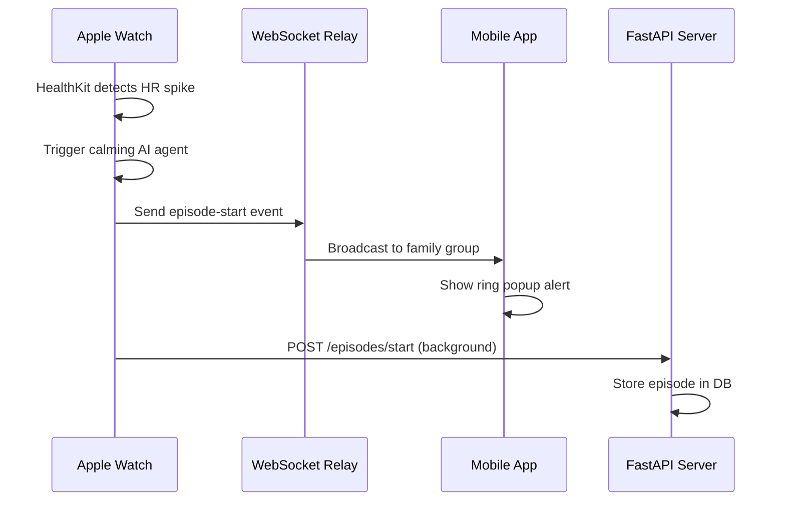
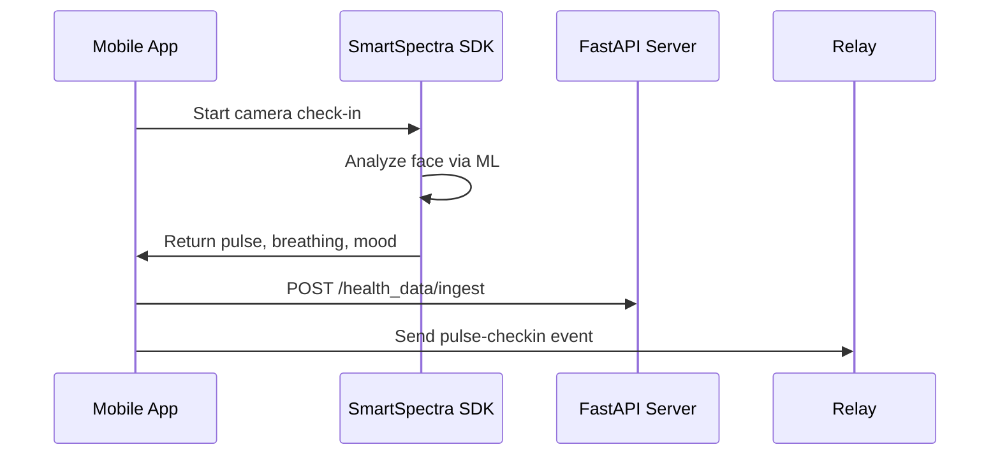
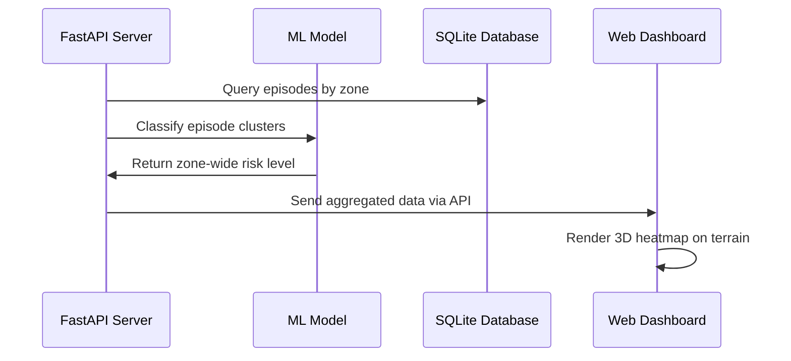

# Architecture Documentation

This document details the architectural decisions, system components, and data flow for **Pulsera**.

## Glossary

> **Note:** Define any domain-specific or non-obvious term used in the codebase here. Terms must be ordered alphabetically.

* **Calming Agent:** AI-powered intervention (ElevenLabs conversational AI) that guides breathing exercises when distress is detected.
* **Check-In:** Contactless vital sign measurement using the iPhone front camera via SmartSpectra SDK (pulse, breathing rate, facial expression).
* **Episode:** A health anomaly detection event, triggered when vitals (heart rate, HRV) cross thresholds. Episodes go through stages: detection → calming → check-in → resolution.
* **PulseNet:** Custom PyTorch anomaly detection model that analyzes individual and community-wide vital signs to detect correlated distress events.
* **Relay Server:** Lightweight WebSocket bridge that translates watch events into mobile notification format for real-time family alerts.
* **Zone:** A geographic area (neighborhood, building, campus) where community-wide safety events are aggregated.

## System Overview

Pulsera is a **real-time, multi-platform health monitoring system** designed around a Watch → Mobile → Server → Web data flow. The architecture follows a **hub-and-spoke model** where:

- **Apple Watch** is the primary sensor (HealthKit vitals)
- **Mobile app** is the family notification hub and check-in interface
- **Backend server** handles episode management, ML inference, and community aggregation
- **Web dashboard** visualizes community safety data with 3D terrain maps

**Architecture Style:** Event-driven microservices with WebSocket-based real-time communication.

## Directory Structure

```
/pulsera
├── apps/
│   ├── watch/              # SwiftUI watchOS app (HealthKit + AI agent)
│   ├── mobile/             # Expo React Native app (family dashboard)
│   ├── web/                # Next.js 16 web dashboard (3D viz + analytics)
│   ├── server/             # FastAPI backend (API + ML inference)
│   ├── relay/              # Python WebSocket relay server
│   └── simulator/          # Python HealthKit simulator (testing)
├── docs/                   # Architecture, API, and setup documentation
├── .agent/                 # Agent skills and workflows
└── package.json            # Root workspace configuration
```

## Tech Stack & Decision Record

| Category | Technology | Rationale |
| :--- | :--- | :--- |
| **Watch App** | SwiftUI + Combine | Native performance required for HealthKit streaming and haptic feedback. Combine for reactive data flow. |
| **Mobile App** | Expo SDK 54 + React Native 0.81 | Cross-platform iOS/Android with fast iteration. Expo Router for native navigation. |
| **Web Dashboard** | Next.js 16 (App Router) + React 19 | Server components for performance, excellent developer experience, seamless Vercel deployment. |
| **Backend** | FastAPI + Uvicorn | Async Python with automatic OpenAPI docs. Perfect for ML integration (PyTorch) and fast iteration. |
| **Database** | SQLite + SQLAlchemy (asyncio) | Lightweight for hackathon MVP. Easy migration to PostgreSQL for production. |
| **ML Framework** | PyTorch 2.5+ | De-facto standard for custom models. PulseNet trained on synthetic + real episode data. |
| **Real-time Comms** | WebSockets (native + websockets lib) | Low-latency bidirectional messaging required for live episode alerts. |
| **3D Visualization** | Three.js + React Three Fiber | Rich 3D terrain rendering for geographic anomaly heatmaps. |
| **Mapping** | MapLibre GL + React Map GL | Open-source alternative to Mapbox with full vector tile support. |
| **State Management** | Zustand (mobile), React Context (web) | Lightweight, simple to reason about. No need for Redux complexity. |
| **Styling** | Tailwind CSS v4 (web), NativeWind (mobile) | Utility-first CSS for rapid prototyping with consistent design tokens. |
| **AI Voice Agent** | ElevenLabs Conversational AI | Real-time voice synthesis with WebSocket streaming for calming interventions. |
| **Contactless Vitals** | SmartSpectra SDK | FDA-grade smartphone photoplethysmography (PPG) via front camera. |

## Data Flow

### 1. Watch → Mobile → Server (Episode Detection)



### 2. Mobile → Server (Check-In)



### 3. Server → Web (Community Aggregation)



## Design Constraints & Trade-offs

* **Decision: WebSocket Relay Server**
  * **Alternative Considered:** Apple WatchConnectivity Framework
  * **Rationale:** WatchConnectivity doesn't work between the macOS watch simulator and a physical iOS device. The WebSocket relay enables testing without a physical Apple Watch.
* **Decision: Prioritized Active Usage Alerts**
  * **Alternative Considered:** 24/7 background HealthKit monitoring
  * **Rationale:** watchOS throttles background queries to preserve battery. We prioritized reliable alerts during active usage for the MVP.
* **Decision: SQLite for Initial Storage**
  * **Alternative Considered:** PostgreSQL
  * **Rationale:** SQLite is lightweight and requires zero configuration for a hackathon environment. Single-device testing does not require high concurrency support.
* **Decision: Git-tracked Model Checkpoints**
  * **Alternative Considered:** Git LFS or S3 Bucket
  * **Rationale:** Checked in small checkpoints for developer convenience during rapid prototyping. Production would migrate to dedicated asset storage.
* **Decision: npm Workspaces Monorepo**
  * **Alternative Considered:** Nx or Turborepo
  * **Rationale:** Avoided the complexity of dedicated monorepo tooling for a small project while maintaining clean separation between apps.

## Security Considerations

* **HealthKit Data:** Encrypted at rest via iOS Keychain, never leaves device except for aggregated, anonymized metrics.
* **API Keys:** ElevenLabs, Gemini, SmartSpectra keys stored in `.env` files (gitignored). Production would use secret managers (AWS Secrets Manager, Doppler).
* **WebSocket Authentication:** Currently unauthenticated (demo purposes). Production needs JWT or session-based auth on WS connections.
* **CORS:** FastAPI configured with explicit allowed origins. Web dashboard whitelisted for cross-origin requests.

## Scalability Notes

### Current Limits (Hackathon MVP)
- **Concurrent users:** ~50 (SQLite bottleneck)
- **Episodes/minute:** ~10 (single-threaded ML inference)
- **WebSocket connections:** ~100 (relay server single-process)

### Production Scaling Path
1. **Database:** Migrate to PostgreSQL with connection pooling
2. **ML Inference:** Deploy PulseNet with FastAPI + Celery workers on GPUs
3. **WebSocket:** Use Redis Pub/Sub for distributed relay server instances
4. **Static Assets:** CDN (Cloudflare) for web dashboard
5. **Mobile:** EAS (Expo Application Services) for OTA updates and push notifications
